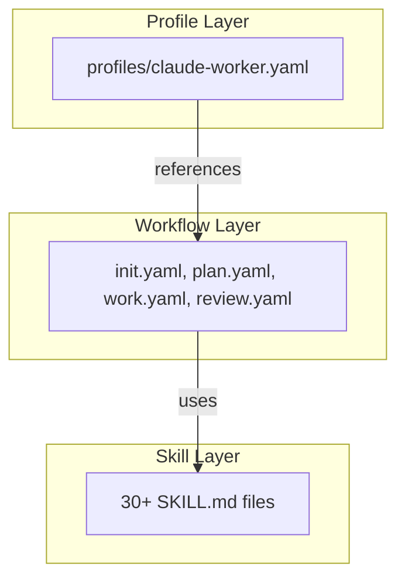

# Claude harness Architecture

## 1. 概要

`claude-code-harness`は、Claude Codeの能力を最大限に引き出すための、モジュール化された自律的な開発フレームワークです。中心的な設計思想は、**Plan → Work → Review**という体系的な開発サイクルを、**Skills**、**Rules**、**Hooks**という3つの主要な拡張機能でサポートすることです。

## 2. 3層アーキテクチャ

このプラグインは、再利用性と保守性を高めるために、以下の3層アーキテクチャを採用しています。



- **Skill Layer**: `SKILL.md`ファイルとして定義される、自己完結した知識ユニットです。特定のタスク（例：セキュリティレビュー、コード実装）を実行するための具体的な手順と知識が含まれています。
- **Workflow Layer**: `*.yaml`ファイルとして定義され、特定の開発フェーズ（例：`/work`）を実行するための**Skills**のオーケストレーションを行います。ステップの順序、条件分岐、エラーハンドリングなどを管理します。
- **Profile Layer**: プラグイン全体の動作を定義します。どのワークフローをどのコマンドに割り当てるか、どのSkillカテゴリを許可するかなどを指定します。

## 3. ディレクトリ構造

```
claude-code-harness/
├── .claude-plugin/         # プラグインメタデータ
│   ├── plugin.json
│   └── hooks.json
├── skills/                 # Skill定義 (SKILL.md + references/)
│   ├── impl/               # 実装スキル
│   ├── harness-review/     # レビュースキル
│   ├── verify/             # 検証スキル
│   ├── planning/           # プランニングスキル
│   ├── setup/              # セットアップスキル
│   ├── ci/                 # CI/CD関連スキル
│   └── ...                 # その他30+スキル
├── agents/                 # サブエージェント定義 (Markdown)
├── hooks/                  # Hooks定義 (hooks.json)
├── scripts/                # 自動化用シェルスクリプト
├── docs/                   # ドキュメント
└── templates/              # 各種テンプレート
```

## 4. 主要コンポーネント

### 4.1. Skills

各スキルは、`description`（いつ使うべきか）と`allowed-tools`（使用許可ツール）を明記することで、Claudeによる自律的な発見と安全な実行をサポートします。

### 4.2. Rules

`claude-code-harness.config.schema.json` で定義されるプロジェクト設定ファイル `.claude-code-harness.config.json`（schema/example はドット無し、実ファイルはドット付きが正準。両名を解決する）により、一部の設定は PreToolUse ガードレールで**実際に強制**されます。

強制される（enforced）セクション:
- `paths.protected` — 宣言したパスへの Write/Edit/MultiEdit を deny（R16。directory prefix と glob の両対応。glob は `filepath.Match` ベースで再帰的な `**` は非対応 = `*` は `/` を跨がないため `config/**.yaml` のような宣言は再帰マッチしない。サブツリー保護には `config/` のような directory prefix を使う。不正な glob は fail-closed で deny）
- `git.protected_branches` — protected branch 判定（R11 reset --hard / R12 direct push）に branch 名を追加
- `runtimefloor.secretAllow` — secret-read hard floor の許可宣言（相対宣言は worktree root 配下として解決され、`cat .env` のような素の相対読み取りにも一致）
- `destructive_commands.allow_rm_rf` — `true` で R05 の `rm -rf` 確認を抑止（既定 false、opt-in）。worktree 外の削除は runtimefloor のハード floor で引き続き停止

参照・共有される（advisory、markdown skill 側で解釈）セクション:
- `safety` / `git.allow_*` / `ci` / `scaffolding` / `destructive_commands`（`allow_rm_rf` 以外）/ `work` / `session` / `orchestration` / `constitution` / `i18n`

> 注: `i18n.language` の正準ソースは YAML の `.claude-code-harness.config.yaml` です。`safety.mode: "dry-run"` はハード block ではなく skill 側のヒントです。

### 4.3. Hooks

`hooks.json`で定義され、開発プロセスの重要なポイントで自動的にスクリプトを実行します。
- **SessionStart**: セッション開始時の環境チェック
- **PostToolUse**: ファイル編集後の自動テストや変更追跡
- **Stop**: セッション終了時のサマリー生成

### 4.4. 並列処理

`/harness-review`コマンドでは、`code-reviewer`サブエージェントを複数同時に起動し、セキュリティ、パフォーマンス、品質のレビューを並列実行することで、フィードバック時間を大幅に短縮します。
